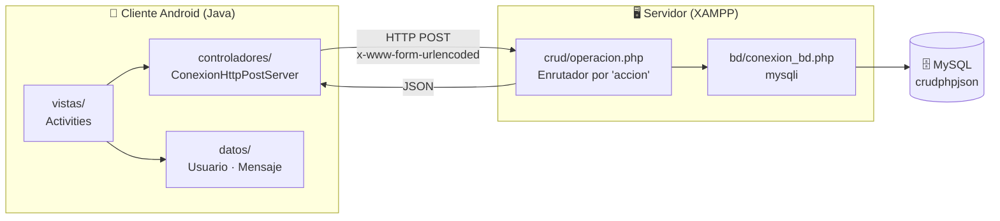
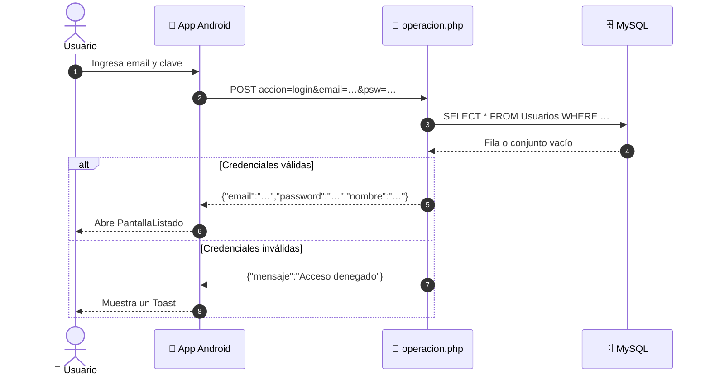
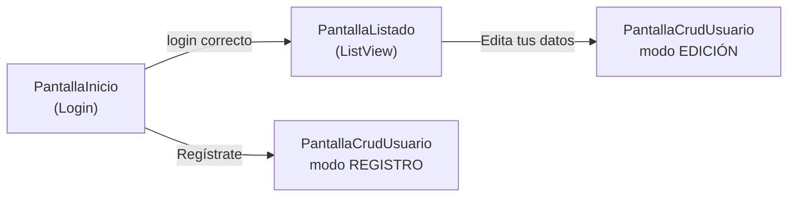

<div align="center">

# 📱 Android · PHP · MySQL — CRUD HTTP/JSON

**Aplicación Android nativa conectada a un servicio web PHP + MySQL mediante HTTP y JSON.**
Login, registro, edición y listado de usuarios: una arquitectura cliente-servidor completa, de punta a punta.

[](#-stack-tecnológico)
[](#-stack-tecnológico)
[](#-stack-tecnológico)
[](#-stack-tecnológico)
[](#-stack-tecnológico)
[](LICENSE)
[](https://github.com/Stevencr-123)

[🚀 Inicio rápido](#-inicio-rápido) ·
[🏗️ Arquitectura](#️-arquitectura) ·
[📡 API](#-referencia-de-la-api) ·
[🔐 Seguridad](#-seguridad-y-hardening) ·
[🗺️ Roadmap](#️-roadmap)

</div>

---

## 📑 Tabla de contenidos

- [✨ Características](#-características)
- [🏗️ Arquitectura](#️-arquitectura)
- [🧰 Stack tecnológico](#-stack-tecnológico)
- [📂 Estructura del repositorio](#-estructura-del-repositorio)
- [🚀 Inicio rápido](#-inicio-rápido)
- [📡 Referencia de la API](#-referencia-de-la-api)
- [🔐 Seguridad y hardening](#-seguridad-y-hardening)
- [🛠️ Solución de problemas](#️-solución-de-problemas)
- [🗺️ Roadmap](#️-roadmap)
- [🤝 Contribuir](#-contribuir)
- [📄 Licencia](#-licencia)
- [👤 Autor](#-autor)

---

## ✨ Características

| | Funcionalidad | Detalle |
|---|---|---|
| 🔑 | **Autenticación** | Login contra el backend con respuesta JSON tipada |
| 📝 | **Registro y edición** | Una sola pantalla con dos modos (alta / edición) |
| 📋 | **Listado de usuarios** | Consumo de `List<Usuario>` con Gson y `ListView` |
| 🗑️ | **Eliminación** | Disponible en el servicio (`accion=eliminar`) |
| 🧵 | **Red fuera del hilo UI** | `ExecutorService` en lugar del obsoleto `AsyncTask` |
| 🌐 | **Cliente HTTP nativo** | `HttpURLConnection` — sin librerías de red externas |
| 🧱 | **Capas separadas** | `datos` · `controladores` · `vistas` en el cliente |

---

## 🏗️ Arquitectura



<details>
<summary><b>🔄 Ver el flujo de un login paso a paso</b></summary>



</details>

<details>
<summary><b>🧭 Ver el flujo de navegación entre pantallas</b></summary>



</details>

---

## 🧰 Stack tecnológico

| Capa | Tecnología | Notas |
|---|---|---|
| **Cliente móvil** | Android (Java 8), AppCompat, Material Components | `minSdk 21` · `targetSdk 34` |
| **Red** | `HttpURLConnection` + `ExecutorService` | Timeout de 10 s, POST codificado en UTF-8 |
| **Serialización** | [Gson 2.10.1](https://github.com/google/gson) | JSON ⇄ objetos Java |
| **Servicio web** | PHP 8.x (sin framework) | Respuestas `application/json; charset=utf-8` |
| **Base de datos** | MySQL / MariaDB (InnoDB, `utf8mb4`) | Tabla `Usuarios` |
| **Entorno local** | XAMPP · phpMyAdmin · Android Studio | |

---

## 📂 Estructura del repositorio

```text
android-php-mysql-crud/
├── 📱 android-app/                  # Proyecto Android Studio
│   └── app/src/main/
│       ├── java/…/ejemploconexionhttp/
│       │   ├── controladores/       # ConexionHttpPostServer (capa HTTP)
│       │   ├── datos/               # Usuario, Mensaje (modelos)
│       │   └── vistas/              # PantallaInicio, PantallaCrudUsuario, PantallaListado
│       └── res/layout/              # Un XML por pantalla
├── 🐘 backend-php/                  # Servicio web (copiar a htdocs/CrudPhpJson)
│   ├── bd/conexion_bd.php           # Conexión y helper consultar()
│   ├── crud/operacion.php           # Endpoint: login · Agregar · editar · listar · eliminar
│   ├── sql/crudphpjson.sql          # Script de creación de BD y tabla
│   └── index.php                    # Health-check de conexión
├── LICENSE
└── README.md
```

---

## 🚀 Inicio rápido

### ✅ Requisitos previos

- [XAMPP](https://www.apachefriends.org/) (Apache + MySQL)
- [Android Studio](https://developer.android.com/studio) (Hedgehog o superior recomendado)
- [Git](https://git-scm.com/)

### 1️⃣ Clonar el repositorio

```bash
git clone https://github.com/Stevencr-123/android-php-mysql-crud.git
cd android-php-mysql-crud
```

### 2️⃣ Levantar el backend

<details open>
<summary><b>🐘 Servicio PHP + MySQL</b></summary>

1. Abre el **Panel de XAMPP** y arranca **Apache** y **MySQL**.
2. Copia la carpeta del backend a `htdocs` **con el nombre `CrudPhpJson`** (la app Android apunta a esa ruta):

```bash
   # Windows (Git Bash)
   cp -r backend-php /c/xampp/htdocs/CrudPhpJson

   # Linux
   sudo cp -r backend-php /opt/lampp/htdocs/CrudPhpJson
```

3. Crea la base de datos importando el script:
   - **phpMyAdmin** → `http://localhost/phpmyadmin` → *Importar* → selecciona `backend-php/sql/crudphpjson.sql`.
   - o por consola: `mysql -u root < backend-php/sql/crudphpjson.sql`
4. Verifica que todo responde:

```bash
   curl http://localhost/CrudPhpJson/
   # → {"mensaje":"Acceso denegado"}   ✅ conexión Apache + PHP + MySQL correcta
```

</details>

### 3️⃣ Ejecutar la app Android

<details open>
<summary><b>📱 Android Studio</b></summary>

1. **File → Open** y selecciona la carpeta `android-app/`.
2. Espera el *Gradle Sync* (requiere internet la primera vez).
3. Configura la URL del servidor en
   `controladores/ConexionHttpPostServer.java` → `direccionDelServidor`:

   | Dónde pruebas | URL |
   |---|---|
   | 🖥️ Emulador | `http://10.0.2.2/CrudPhpJson/crud/operacion.php` |
   | 📲 Celular físico | `http://IP_DE_TU_PC/CrudPhpJson/crud/operacion.php` |

   > 💡 En un dispositivo físico, el celular y el PC deben estar en la **misma red WiFi**.
   > Obtén tu IP con `ipconfig` (Windows) o `ip a` (Linux) y permite Apache en el Firewall.

4. Pulsa **▶ Run** y listo.

</details>

---

## 📡 Referencia de la API

**Endpoint único:** `POST /CrudPhpJson/crud/operacion.php`
El comportamiento lo decide el parámetro `accion`. Todas las respuestas son JSON.

| Acción | Parámetros | Respuesta exitosa | Respuesta de error |
|---|---|---|---|
| `login` | `email`, `psw` | `{"email","password","nombre"}` | `{"mensaje":"Acceso denegado"}` |
| `Agregar` | `email`, `psw`, `nombre` | `{"mensaje":"OK"}` | `{"mensaje":"Usuario no registrado"}` |
| `editar` | `email`, `psw`, `nombre` | `{"mensaje":"OK"}` | `{"mensaje":"Usuario no registrado"}` |
| `listar` | — | `[{"email","password","nombre"}, …]` | `{"mensaje":"No hay Usuarios"}` |
| `eliminar` | `email` | `{"mensaje":"OK"}` | `{"mensaje":"Usuario no existe"}` |

<details>
<summary><b>🧪 Probar con cURL</b></summary>

```bash
BASE=http://localhost/CrudPhpJson/crud/operacion.php

# Registrar
curl -X POST $BASE -d "accion=Agregar" -d "email=demo@correo.com" -d "psw=1234" -d "nombre=Usuario Demo"

# Login
curl -X POST $BASE -d "accion=login" -d "email=demo@correo.com" -d "psw=1234"

# Listar
curl -X POST $BASE -d "accion=listar"

# Editar
curl -X POST $BASE -d "accion=editar" -d "email=demo@correo.com" -d "psw=5678" -d "nombre=Nombre Nuevo"

# Eliminar
curl -X POST $BASE -d "accion=eliminar" -d "email=demo@correo.com"
```

</details>

<details>
<summary><b>🗄️ Ver el esquema de base de datos</b></summary>

```sql
CREATE TABLE IF NOT EXISTS Usuarios (
    email    VARCHAR(70)  PRIMARY KEY NOT NULL,
    password VARCHAR(40)  NOT NULL,
    nombre   VARCHAR(100) NOT NULL
) ENGINE=INNODB;
```

</details>

---

## 🔐 Seguridad y hardening

> [!WARNING]
> Este proyecto es **educativo** y está diseñado para ejecutarse en una **red local de desarrollo**.
> **No lo expongas a internet** sin aplicar las mejoras de la tabla inferior.

| Estado actual | Riesgo | Mejora recomendada |
|---|---|---|
| Consultas SQL con parámetros concatenados | 🔴 Inyección SQL | Sentencias preparadas (`mysqli::prepare` / PDO) |
| Contraseñas guardadas en texto plano | 🔴 Exposición de credenciales | `password_hash()` / `password_verify()` (ampliar columna a `VARCHAR(255)`) |
| `login` y `listar` devuelven el campo `password` | 🔴 Fuga de datos | Excluir la contraseña de toda respuesta |
| Sin autenticación en `listar` / `eliminar` / `editar` | 🟠 Acceso no autorizado | Tokens (JWT o sesiones) y control de permisos |
| Tráfico HTTP sin cifrar (`usesCleartextTraffic="true"`) | 🟠 Intercepción de datos | HTTPS + quitar el permiso *cleartext* en producción |
| Usuario `root` sin contraseña en `conexion_bd.php` | 🟠 Configuración insegura | Usuario dedicado con privilegios mínimos y variables de entorno |

---

## 🛠️ Solución de problemas

<details>
<summary><b>La app muestra «ERROR 3: Conexion fallida»</b></summary>

- Confirma que Apache está en verde y que la URL responde en el navegador del PC.
- Emulador → usa `10.0.2.2`, **no** `localhost`.
- Dispositivo físico → misma red WiFi, IP correcta y Apache permitido en el Firewall.

</details>

<details>
<summary><b>«ERROR 2: URL invalida (HTTP 404)»</b></summary>

La carpeta en `htdocs` debe llamarse exactamente `CrudPhpJson` (respeta mayúsculas) o debes ajustar `direccionDelServidor`.

</details>

<details>
<summary><b>El navegador muestra «No se pudo conectar con la base de datos»</b></summary>

Verifica que MySQL esté iniciado, que la base `crudphpjson` exista y que las credenciales de `bd/conexion_bd.php` coincidan con tu instalación.

</details>

---

## 🗺️ Roadmap

- [x] CRUD completo en el servicio PHP
- [x] Cliente Android con login, registro/edición y listado
- [x] Migración de `AsyncTask` + `HttpClient` a `ExecutorService` + `HttpURLConnection`
- [ ] Sentencias preparadas y hash de contraseñas
- [ ] Opción de eliminar usuarios desde la app
- [ ] Autenticación por token (JWT)
- [ ] Migrar a Retrofit + ViewModel / LiveData
- [ ] Reemplazar `ListView` por `RecyclerView`
- [ ] Contenerizar el backend con Docker Compose (PHP + MySQL)
- [ ] Pruebas automatizadas y CI con GitHub Actions
- [ ] Capturas de pantalla y GIF de demostración

---

## 🤝 Contribuir

Las contribuciones son bienvenidas.

1. Haz un **fork** del proyecto
2. Crea tu rama: `git checkout -b feat/mi-mejora`
3. Haz commit: `git commit -m "feat: descripción de la mejora"`
4. Sube la rama: `git push origin feat/mi-mejora`
5. Abre un **Pull Request** 🎉

---

## 📄 Licencia

Distribuido bajo la licencia **MIT**. Consulta el archivo [`LICENSE`](LICENSE) para más información.

> Proyecto de carácter académico basado en la guía del taller *«Desarrollo de App Android conectadas a una aplicación Web»*, adaptado y modernizado.

---

## 👤 Autor

<div align="center">

**Stevencr-123**

[](https://github.com/Stevencr-123)

⭐ Si este proyecto te resultó útil, ¡regálale una estrella al repositorio!

</div>